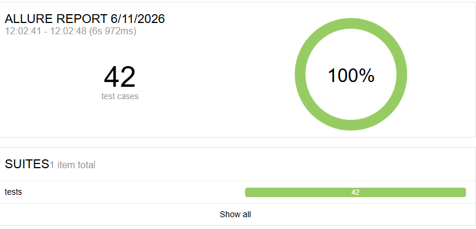

# english_games 🎮
Play games and practice English

A collection of browser-based games for practising English.  
Built with Python (Flask) for the backend and JavaScript for the frontend.

You can play the games at http://lankova.tech/

---

## 🎲 Games in this project

| Game                   | Description                                           |
|------------------------|-------------------------------------------------------|
| **Describe and Guess** | A word-guessing adventure. 2+ players                 |
| ***Spy in Ithaca***    | Ask questions. Trust no one. Find the spy. 3+ players |

---

## 🛠️ Tech Stack

- **Backend**: Python, Flask
- **Frontend**: HTML, CSS, JavaScript
- **Data storage**: SQLite (rooms, players), JSON files (game cards)
- **Version control**: Git, GitHub

---

## 🧪 Testing

24 automated tests with pytest + Allure.

 ## 📌 Status

This project is in active development. New games and features will be added over time.

